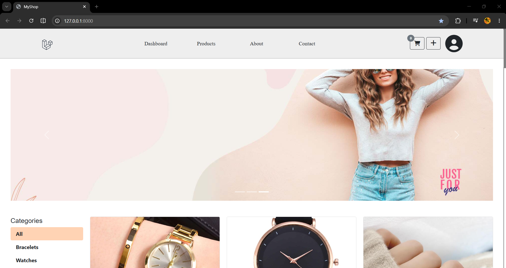
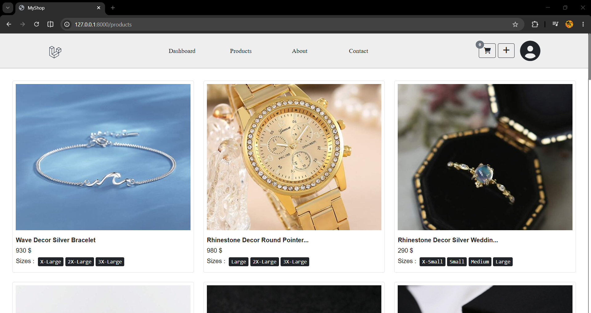
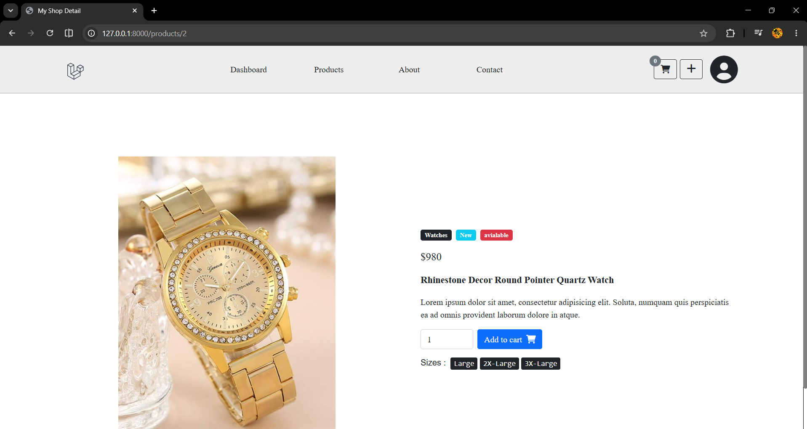
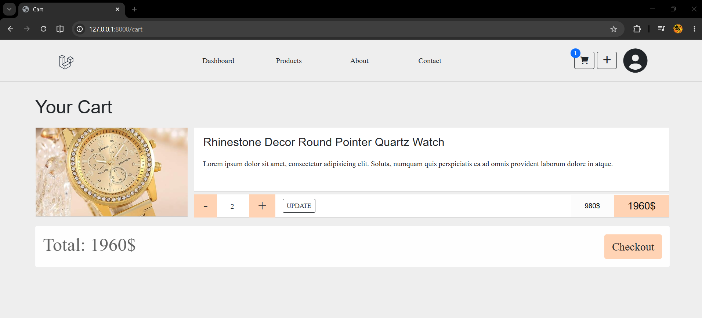
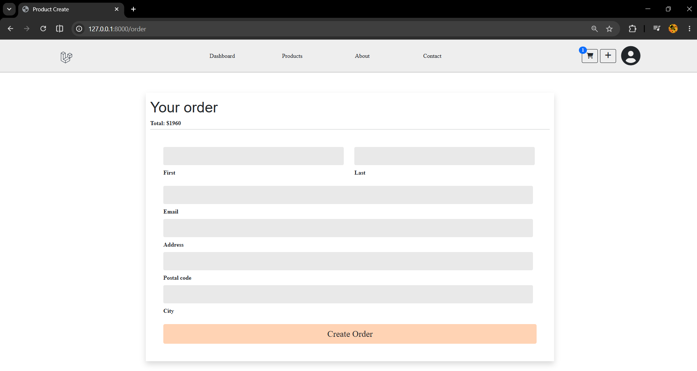

# Laravel Shop

An e-commerce web application built with Laravel that allows users to browse products, manage a shopping cart, place orders, and complete payments through a user-friendly interface.

## Features

### Customer Features

- User registration and authentication
- Browse products
- Product details page
- Add products to cart
- Update cart quantities
- Remove items from cart
- Checkout process
- Order management
- Payment integration

### Admin Features

- Super Admin dashboard
- Product management
- Order management
- User management
- Store administration

## Technologies Used

- Laravel
- PHP
- MySQL
- Blade Templates
- Bootstrap
- JavaScript
- HTML/CSS

## Installation

### Clone the repository

```bash
git clone https://github.com/RedaFarissi/laravel_shop.git
cd laravel_shop
```

### Install dependencies

```bash
composer install
```

### Create environment file

```bash
cp .env.example .env
```

### Generate application key

```bash
php artisan key:generate
```

### Configure database

Update your `.env` file:

```env
DB_CONNECTION=mysql
DB_HOST=127.0.0.1
DB_PORT=3306
DB_DATABASE=laravel_shop
DB_USERNAME=root
DB_PASSWORD=
```

### Run migrations

```bash
php artisan migrate
```

### Start the development server

```bash
php artisan serve
```

Open:

```text
http://127.0.0.1:8000
```

## Screenshots

### Home Page


### Products


### Product detail


### Cart



### Checkout


### Admin Dashboard


## Project Structure

```text
app/
bootstrap/
config/
database/
public/
resources/
routes/
storage/
tests/
```

## Future Improvements

- Product reviews
- Wishlist system
- Email notifications
- Multi-language support
- Advanced analytics dashboard

## Author

### Reda Farissi

GitHub:
https://github.com/RedaFarissi

## License

This project is open-source and available for learning purposes.
